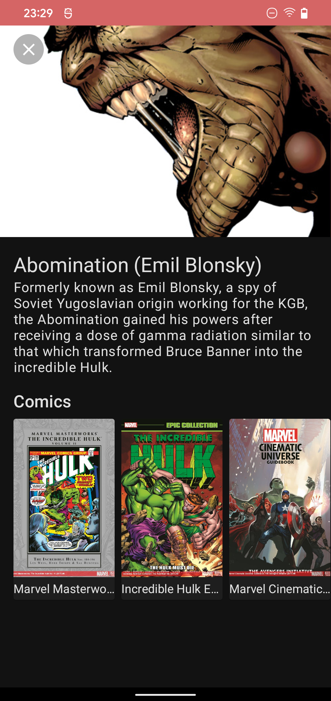

# MarvelAPISample
Simple project consuming Marvel API (https://developer.marvel.com/) while using some advanced Android and software components, written in Kotlin.


# Setup
In order to make it work, you must add a keys.properties file at app module directory level. It needs to contain the APIs obtained from https://developer.marvel.com/documentation/authorization and follow this structure:

```
MARVEL_PRIVATE_KEY="yourPrivateKey"
MARVEL_PUBLIC_KEY="yourPublicKey"
```

# Screenshots




# Branches
 - main: meant to be the "production ready" code.
 - compose: integrating [Jetpack Compose](https://developer.android.com/jetpack/compose).
